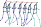

# Aschaffenburg Pose Dataset (APD) [](https://doi.org/10.5281/zenodo.5724486)


This repository contains Python code for loading and filtering the Aschaffenburg Pose Dataset.
The dataset itself and a description can be found at **[Zenodo]**.
It contains trajectories as well as body poses of pedestrians and cyclists in road traffic
recorded in Aschaffenburg, Germany. It is appropriate for training and testing methods for
trajectory forecasting and intention prediction of vulnerable road users (VRUs) based on
the past trajectory and body poses.

The body posture of the pedestrians and cyclists is available in the form of 2D and 3D poses.
The 2D poses contain joint positions in an image coordinate system, while the 3D poses contain
actual three-dimensional positions. The joints of the poses are shown in the picture below.
The left skeleton shows the joints of the 2D poses and the right one shows the joints of the
3D poses. A detailed description and evaluation of the pose estimation method can be found in
[1]. In addition to the trajectories and the poses, manually created labels of the respective
motion states are included.


[Zenodo]: https://doi.org/10.5281/zenodo.5724486

## Usage
First download the dataset **[here]** and unzip the file. The actual Python module for
loading and filtering the dataset can be found in the folder `APD`. In `examples` you
find the example of how to use the code (`plot_trajectories.py`). The example loads the
dataset from the provided path and plots the smoothed head trajectories in 2D from a bird's
eye view (the poses are not visualized here). The trajectories can be filtered by VRU type
and set using optional arguments:
```
Usage: python3 examples/plot_trajectories.py [-h] [-v VRU_TYPES] [-s SETS] path

Pipeline Arguments

positional arguments:
  path                  path to json files

optional arguments:
  -h, --help            show this help message and exit
  -v VRU_TYPES, --vru_types VRU_TYPES
                        select certain vru types for plotting ['ped', 'bike']
  -s SETS, --sets SETS  select certain sets for plotting ['train',
                        'validation', 'test']
```
[here]: https://doi.org/10.5281/zenodo.5724486

## Citation
If you find this dataset useful, please cite this paper (and refer the data as Aschaffenburg Pose Dataset or APD):

> Kress, V. ; Zernetsch, S. ; Doll, K. ; Sick, B. : Pose Based Trajectory Forecast of Vulnerable Road Users Using Recurrent Neural Networks. In: Pattern Recognition. ICPR International Workshops and Challenges, Springer International Publishing, 2020, pp. 57-71

## Similar Datasets
- **[Pedestrians and Cyclists in Road Traffic: Trajectories, 3D Poses and Semantic Maps]**
- **[Cyclist Actions: Optical Flow Sequences and Trajectories]**
- **[Cyclist Actions: Motion History Images and Trajectories]**
- **[More datasets]**

[Pedestrians and Cyclists in Road Traffic: Trajectories, 3D Poses and Semantic Maps]: https://doi.org/10.5281/zenodo.4898838
[Cyclist Actions: Optical Flow Sequences and Trajectories]: 10.5281/zenodo.3734038
[Cyclist Actions: Motion History Images and Trajectories]: https://doi.org/10.5281/zenodo.4080940
[More datasets]: https://www.th-ab.de/ueber-uns/organisation/labor/kooperative-automatisierte-verkehrssysteme/trajectory-dataset/

## Acknowledgment
This work was supported by “Zentrum Digitalisierung.Bayern”. In addition, the work is
backed by the project DeCoInt2 , supported by the German Research Foundation (DFG)
within the priority program SPP 1835: “Kooperativ interagierende Automobile”, grant
numbers DO 1186/1-2 and SI 674/11-2.

## References
> [1] Kress, V. ; Jung, J. ; Zernetsch, S. ; Doll, K. ; Sick, B. : Human Pose Estimation in Real Traffic Scenes. In: IEEE Symposium Series on Computational Intelligence (SSCI), 2018, pp. 518–523, doi: 10.1109/SSCI.2018.8628660
